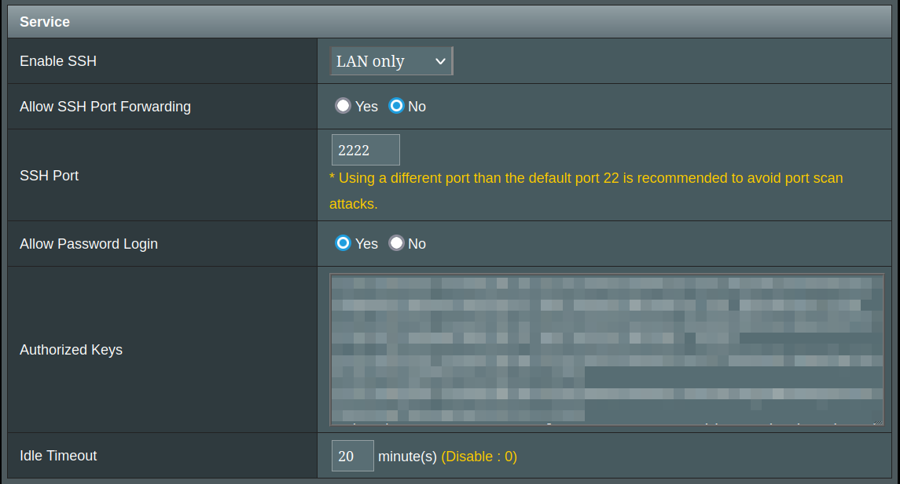

ansible-asuswrt-merlin-openssh
=========

Asuswrt-Merlin is a third party alternative firmware for Asus routers, with a special emphasis on tweaks and fixes rather than radical changes or collecting as many features as possible.

Asuswrt-Merlin ships with Dropbear SSH.  Dropbear is a lightweight SSH server and client software package. It is designed to be small enough to run on embedded systems with limited memory and processor resources, while still providing secure and functional SSH capabilities.

However, some users may want the full functionality of OpenSSH. ansible-asuswrt-merlin-openssh installs and configures OpenSSH using ansible, following the How-To guide in the Asuswrt-Merlin wiki.

https://asuswrt-merlin.net/

https://github.com/RMerl/asuswrt-merlin.ng/wiki

Requirements
------------

This role will start OpenSSH on `22/tcp`.  We assume that the bootstrap/Dropbear SSH port has been set to `2222/tcp`.  Both of these ports are configurable.

Configure the bootstrap/Dropbear port by navigating to Administration -> System.



If you choose to use other ports, set them with the following variables.

```yaml
bootstrap_ssh_port: '2222'
openssh_port: '22'
```

This role requires the `community.general` collection.

```yaml
collections:
  - name: community.general
    version: ">=6.0.0"
```

Add the above to `requirements.txt`, and install them with the following command.

```sh
ansible-galaxy install -r requirements.txt
```

Role Variables
--------------

Below are the configurable variables, and their default values.

```yaml
ansible_python_interpreter: '/opt/bin/python'
ansible_ssh_common_args: '-o StrictHostKeyChecking=no'
bootstrap_ssh_port: '2222'
group: 'root'
openssh_address_family: 'any'
openssh_authorized_keys_command: 'none'
openssh_authorized_keys_command_user: 'nobody'
openssh_authorized_keys_file: '.ssh/authorized_keys'
openssh_authorized_principals_file: 'none'
openssh_ciphers: '+chacha20-poly1305@openssh.com,aes256-gcm@openssh.com,aes256-ctr,aes256-cbc'
openssh_host_key:
  - 'rsa'
  - 'ed25519'
openssh_listen_address:
  - '0.0.0.0'
openssh_login_grace_time: '2m'
openssh_log_level: 'INFO'
openssh_max_auth_tries: '6'
openssh_max_sessions: '10'
openssh_port: '22'
openssh_pubkey_authentication: 'yes'
openssh_rekey_limit: 'default none'
openssh_root_login: 'yes'
openssh_sftp: true
ansible_ssh_common_args: '-o StrictHostKeyChecking=no'
openssh_strict_modes: 'yes'
openssh_syslog_facility: 'AUTH'
```

Example Playbook
----------------

Below is an example playbook.  Ensure that `gather_facts: false` is set.  Ansible cannot gather system facts until `python3` is installed on the `inventory_host`.  Once `python3` is installed, the role will gather system facts.

```yaml
  - hosts: asuswrt_merlin
    gather_facts: false
    roles:
      - ansible-asuswrt-merlin-openssh
```

License
-------

MIT

Author Information
------------------

This role was created in 2024 by ClosedWontFix.
